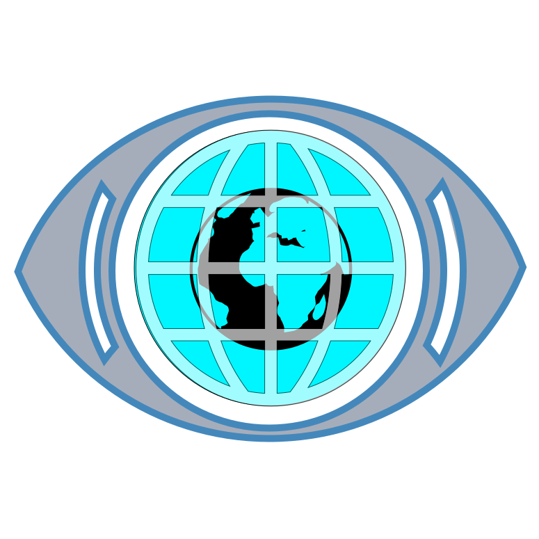

<p align="center">
  
</p>

# God's Eye View on StartOS

> Everything not listed in this document should behave the same as upstream
> God's Eye View. If a feature, setting, or behavior is not mentioned here,
> the upstream documentation is accurate and fully applicable — see the
> Documentation section of `instructions.md` for links.

God's Eye View renders live public data — aircraft transponders, ship beacons, satellite orbits, earthquakes, wildfires, traffic and public webcams — on a photorealistic 3D globe in the browser. Upstream: <https://github.com/bilawalsidhu/gods-eye-view>

---

## Table of Contents

- [Image and Container Runtime](#image-and-container-runtime)
- [Volume and Data Layout](#volume-and-data-layout)
- [File Models](#file-models)
- [Dependencies](#dependencies)
- [Network Access and Interfaces](#network-access-and-interfaces)
- [Installation and First-Run Flow](#installation-and-first-run-flow)
- [Actions](#actions)
- [Tasks](#tasks)
- [Health Checks](#health-checks)
- [Backups and Restore](#backups-and-restore)
- [Limitations and Differences](#limitations-and-differences)
- [Quick Reference for AI Consumers](#quick-reference-for-ai-consumers)

---

## Image and Container Runtime

Upstream publishes no container image, so this package builds one from upstream source with its own `Dockerfile`. The build clones the upstream repository at a pinned commit, runs `npm ci`, and produces a keyless client build that ships inside the image.

| What | Value |
| --- | --- |
| Image source | Custom `Dockerfile`, built from upstream source at a pinned commit (see `UPDATING.md`) |
| Architectures | x86_64, aarch64 |
| Entrypoint | None — the daemon runs Vite directly from `/app/node_modules/.bin/vite` |

The package runs a **single subcontainer named `gods-eye-view`**, shared by the build oneshot and the serving daemon. Attach to it with `start-cli package attach gods-eye-view -n gods-eye-view -- <cmd>`.

Upstream's server is not a standalone HTTP server: every API proxy in `server/providers/*` is a Vite plugin registering both `configureServer` and `configurePreviewServer`. The daemon therefore runs `vite preview`, which serves the built client *and* the API proxies from one process. The working directory is `/app`, which matters because upstream resolves its caches relative to `process.cwd()`.

## Volume and Data Layout

One volume, `main`, holding everything the service persists. All of it is small; the caches are the only part that grows, and they are disposable.

| Path on volume | Mounted at | Purpose |
| --- | --- | --- |
| `.env` | `/app/.env` (readonly) | API keys and tunables, written only by actions |
| `store.json` | not mounted | UI gate password, read by the host side of the package |
| `cache/` | `/app/.gev-cache` | Upstream's provider caches — TomTom tiles, FIRMS, terrain heights, ADS-B lookups |

`.env` is mounted readonly because the service never writes it; the package's actions are its only writer.

## File Models

Two, both on the `main` volume.

| Model | File | Contents |
| --- | --- | --- |
| `envFile` | `.env` | The API keys and spend controls the actions manage |
| `store` | `store.json` | `uiPassword` — the reverse-proxy gate credential |

`envFile` names only the keys this package manages. Upstream's advanced tunables (the `CCTV_*` source-pack options, `AISSTREAM_BOUNDING_BOXES`, the `OPENAI_REALTIME_*` model overrides) are deliberately unnamed, so a value set by hand on the volume survives every wrapper write.

An empty string means "not configured" throughout. Upstream guards each key with a truthiness check, so the actions clear a field by writing `''` rather than removing the line.

## Dependencies

None.

## Network Access and Interfaces

One HTTP interface, and heavy outbound traffic to third parties.

| Interface | Type | Internal port |
| --- | --- | --- |
| `ui` | ui | 4173 |

The binding sets `addSsl.auth` to HTTP Basic, so the **OS reverse proxy challenges every request before it reaches the container**. This is deliberate and not cosmetic: the same origin serves `/api/openai/*`, `/api/google/*` and `/api/tomtom`, which spend the user's own metered API credit. A UI-only gate would leave those open. Upstream ships no login of its own, which is why the OS gate is used rather than an app-native credential.

The daemon runs with `HOST=0.0.0.0`. Upstream's `build/vite.js` opens Vite's `allowedHosts` only when `HOST` is `0.0.0.0` or `::`; without it Vite rejects any `Host` header that is not `localhost`, `127.0.0.1` or `*.local`, which would break the LAN-IP and `.onion` addresses StartOS serves.

**Outbound**: this service is a client for roughly a dozen third-party APIs — Google, OpenAI, OpenSky, CelesTrak, USGS, NASA FIRMS, AISStream, TomTom, Overpass and municipal camera feeds. Those requests leave from the server's own IP and are not routed over Tor. Nothing needs to be declared for this to work, but it is the single most important fact about the service's privacy posture.

## Installation and First-Run Flow

The service is usable immediately after install with no configuration.

On init, `seedFiles` creates `.env` and `store.json`, and generates `uiPassword` if one is missing. That generation is not gated on `kind === 'install'` — an empty password would configure the OS gate to accept `admin` with no password, which is worse than no gate, so it is repaired whenever it is absent.

On every start, the `build-client` oneshot runs `vite build` before the `ui` daemon. This exists because `GOOGLE_MAPS_API_KEY` and `CESIUM_ION_TOKEN` are **not runtime values** — upstream's `build/vite.js` injects them into the browser bundle through Vite's `define`, so they change only on a rebuild. The rebuild is unconditional rather than guarded by a hash of the keys because it takes roughly two seconds: Cesium never passes through the bundler, it is copied to `dist/cesium` and loaded by a plain script tag. The image ships a keyless build, so a failed oneshot still leaves something servable behind.

`main.ts` reads `.env` with `.const()`, so saving any key action re-runs `setupMain`, which rebuilds the client and restarts the server. No action needs to ask the user to restart.

## Actions

Five. The two credential actions are the ones a support agent will reach for; the three configuration actions all restart the service on save.

| Action | When to run it | Cost / repeatability | State changed |
| --- | --- | --- | --- |
| `show-ui-password` | User cannot sign in, or never recorded the password | Free, read-only, safe to repeat | None |
| `reset-ui-password` | Password lost or believed exposed | Free and safe to repeat, but invalidates the old password immediately | `store.json` |
| `map-keys` | Globe imagery is unreliable, or the user wants Google's 3D tiles | Restarts the service; rebuild takes a few seconds | `.env` |
| `data-feed-keys` | A specific layer (fires, vessels, traffic) is missing | Restarts the service | `.env` |
| `spend-controls` | Voice control wanted, or metered spend needs throttling | Restarts the service | `.env` |

`reset-ui-password` does not need a restart — `setInterfaces` reads `uiPassword` with `.const()`, so the proxy picks up the new credential on write. Browsers cache HTTP Basic credentials aggressively, so a user who "still gets in with the old password" is seeing their browser, not a failed reset; a new private window settles it.

`data-feed-keys` also derives `OPENSKY_AUTH_MODE`, setting it to `oauth` only when both the OpenSky client id and secret are present, and `anon` otherwise. Upstream defaults that variable to `oauth`, which fails without a full credential, while the anonymous path works unauthenticated.

## Tasks

None.

## Health Checks

One, the `ready` check on the `ui` daemon. It reports the web interface as ready once port 4173 is listening, with a 30-second grace period — the preview server reads Cesium off disk on first request, and the `build-client` oneshot runs before the daemon starts at all.

A service that sits in starting for much longer than that is usually a failing `build-client` oneshot rather than a slow daemon; the oneshot's output is in the service logs.

## Backups and Restore

`sdk.Backups.ofVolumes('main')` — the whole volume.

That includes `cache/`, which is disposable and could have been excluded. It is kept because the volume is small, the caches are bounded, and including them keeps the restore path simple: a restored install comes back with the same API keys and the same UI password, and needs no reconfiguration.

## Limitations and Differences

- **Upstream's in-app key panel does not work here.** The "POWER UP" panel posts to `/api/setup/keys`, which upstream registers only under `vite dev` (`command === 'serve' && !isPreview`) and restricts to loopback. This package serves with `vite preview`, so that route returns 404 and the browser logs one failed request to `/api/setup/status` on load. Keys come from this package's actions instead. The failed request is cosmetic.
- **The browser-side Google key is readable by anyone who can sign in.** It is compiled into the page by design upstream. Restrict it by HTTP referrer at Google and set a billing cap. StartOS serves the same page over `.local`, a LAN IP and an onion address, so referrer restriction is awkward to scope tightly.
- **Keyless operation depends on a shared token.** With no Cesium ion token configured, imagery comes from CesiumJS's bundled default token, which is shared across all users of the library and rate-limited. It works and looks good, but a token of the user's own is more reliable.
- **This is a dev-grade server.** Upstream describes itself as "a fast, hackable foundation, not a hardened production service," and `vite preview` is Vite's preview server, not a hardened one. The OS auth gate is what stands in front of it.
- **Not a private service.** See Network Access and Interfaces. Every tile request tells the imagery provider where the user is looking, and voice control streams microphone audio to OpenAI.
- **Bundled data carries non-MIT terms.** Upstream's code is MIT, but its bundled datasets are not: the TeleGeography submarine-cable map is CC BY-NC-SA 3.0 (non-commercial, share-alike), the datacenter and dam sets are ODbL 1.0, and `public/models/` is excluded from the MIT grant. Upstream's LICENSE anticipates removing datasets whose terms conflict with a given use.
- **Upstream moves fast and tags rarely.** The image pins a commit, not a release. See `UPDATING.md`.

---

## Quick Reference for AI Consumers

```yaml
package_id: gods-eye-view
image: built from upstream source via Dockerfile
architectures: [x86_64, aarch64]
subcontainers: [gods-eye-view]
volumes:
  main: /app/.env, /app/.gev-cache
file_models:
  - .env
  - store.json
startos_managed_env_vars:
  - GOOGLE_MAPS_API_KEY
  - GOOGLE_MAPS_SERVER_API_KEY
  - CESIUM_ION_TOKEN
  - OPENAI_API_KEY
  - FIRMS_MAP_KEY
  - AISSTREAM_API_KEY
  - TOMTOM_API_KEY
  - LL2_API_TOKEN
  - OPENSKY_AUTH_MODE
  - OPENSKY_CLIENT_ID
  - OPENSKY_CLIENT_SECRET
  - GEV_RATELIMIT_GOOGLE_PER_MIN
  - GEV_RATELIMIT_OPENAI_PER_MIN
  - TOMTOM_DAILY_TILE_BUDGET
  - HOST
  - PORT
dependencies: none
interfaces:
  ui: { type: ui, port: 4173 }
actions:
  - show-ui-password
  - reset-ui-password
  - map-keys
  - data-feed-keys
  - spend-controls
tasks: []
health_checks:
  - ui
```
